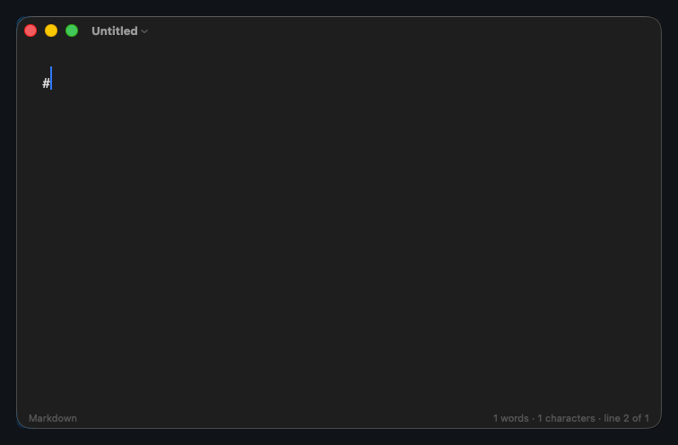

# Markpad

A minimal markdown notepad for macOS. Intentionally simple with no AI, no fancy bells and whistles.



Markdown is shown the way Obsidian shows it: the syntax is hidden and the text
renders in place, with the raw markers coming back only on the line the cursor
is on. There is no preview pane and no second copy of your writing — you edit
the formatted text directly, and the file on disk is always exactly the
characters you typed.

## Keyboard

| | |
| :--- | :--- |
| New window / New tab / Open | `⌘N` `⌘T` `⌘O` |
| Save / Save As | `⌘S` `⇧⌘S` |
| Find / Find & Replace / Next / Previous | `⌘F` `⌥⌘F` `⌘G` `⇧⌘G` |
| Go to Line | `⌘L` |
| Bold / Italic / Strikethrough | `⌘B` `⌘I` `⇧⌘X` |
| Inline code / Link / Code block | `⇧⌘C` `⌘K` `⌥⌘C` |
| Heading 1–6 / Body text | `⌘1`–`⌘6` / `⌘0` |
| Bullet / Numbered / Task / Quote | `⇧⌘8` `⇧⌘7` `⇧⌘9` `⇧⌘.` |
| Zoom in / out / actual size | `⌘+` `⌘−` `⌃⌘0` |
| Hide Markdown syntax / Highlighting | `⌃⌘E` `⌃⌘H` |
| Status bar / Line numbers | `⌃⌘S` `⌃⌘L` |
| Show all tabs / Previous / Next | `⇧⌘\` `⌃⇧⇥` `⌃⇥` |
| Settings / Shortcut reference | `⌘,` `⌘/` |

## Install

Requires macOS 13 or later and the Xcode command line tools
(`xcode-select --install`).

```sh
git clone https://github.com/ujain1999/markpad.git
cd markpad
./build.sh
open build/Markpad.app
```

`build.sh` produces a universal `build/Markpad.app` (arm64 + x86_64). Drag it
into `/Applications` to install it properly. The binary is ad-hoc signed rather
than notarized, so on another Mac Gatekeeper will block the first launch —
right-click the app and choose Open to clear that.